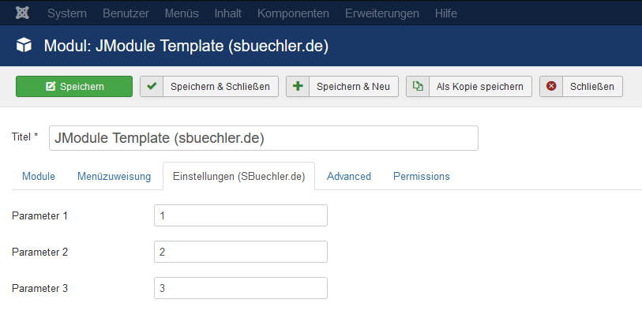
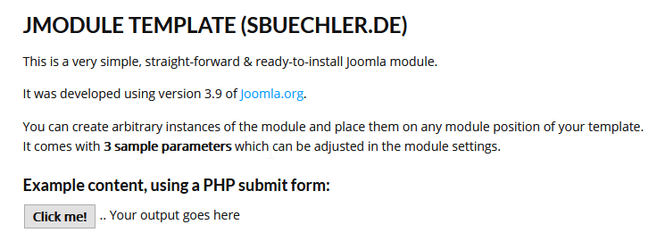

# JModule - Sample Joomla Module
Very simple, straight-forward & ready-to-install Joomla module.
It was developed using version 3.9 of [**Joomla! CMS**](https://www.joomla.org/3/ "Joomla.org").

After installing, you can create arbitrary instances of the module and place them on any module position of your template.
It comes with 3 sample parameters which can be adjusted in the module settings. The sample module content shows some static text and a PHP button, which prints some text to the div container nearby.

## Screenshots

Backend - Settings (German):

Frontend - Module content:

## Languages
*JModule* features language support for `German (de)` and `English (en)` Joomla installations.

## Prerequisite
A working installation of [**Joomla! CMS**](https://www.joomla.org/ "Joomla.org").

## Testing
For testing purposes, I recommend using [**XAMPP**](https://www.apachefriends.org/de/index.html "XAMPP") for deploying the site locally with Apache and MySQL.

For backuping and restoring needs, try to use the latest versions of [**Akeeba Backup**](https://www.akeebabackup.com/download.html "Akeeba Backup") and [**Akeeba Kickstart**](https://www.akeebabackup.com/download/akeeba-kickstart/7-0-0.html "Akeeba Kickstart").

  
## Installation of the module on your site
1. Clone this repository somewhere on your PC
2. Right-click on the folder *mod_tmpl_sbuechler* and zip it
3. Go to your site's backend > Extensions > Install > *Upload package file* and choose or drag-and-drop your zip file
4. After installing, navigate to *Extensions* > *Modules*, select the automatically created instance of **JModule Template**, set a module position and start playing around
